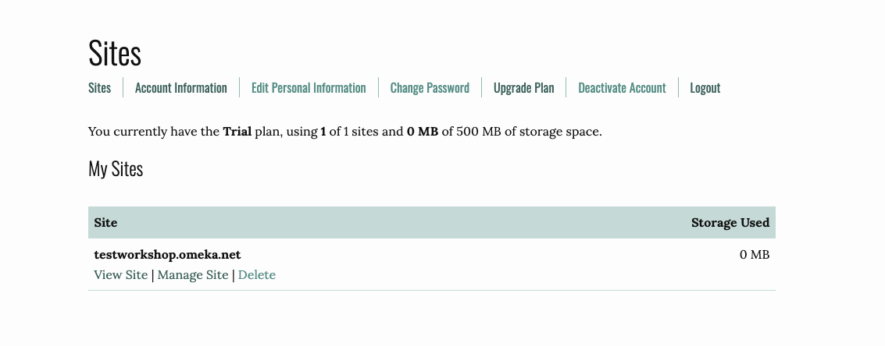
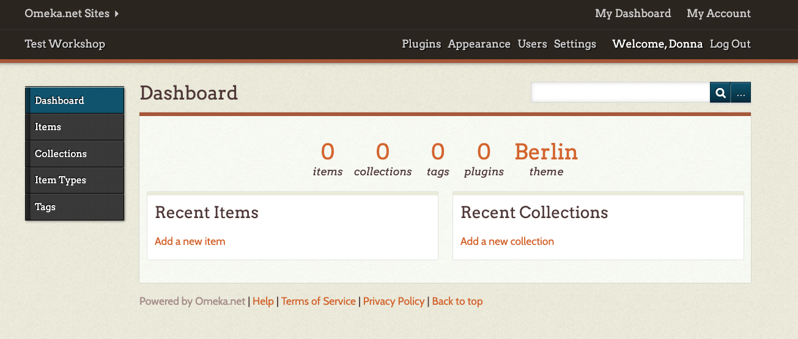
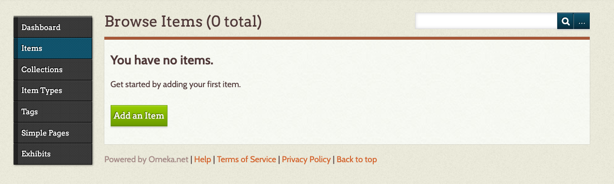
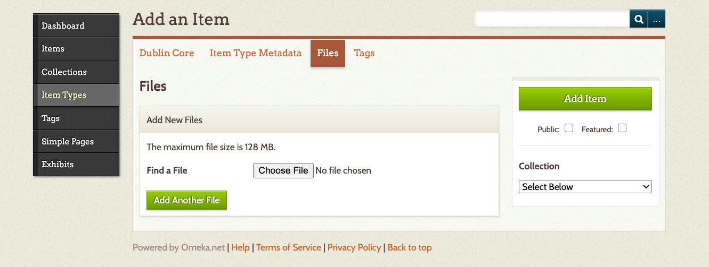
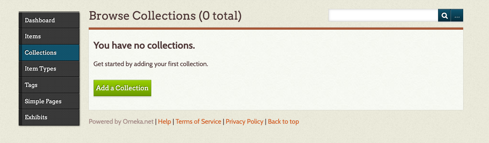
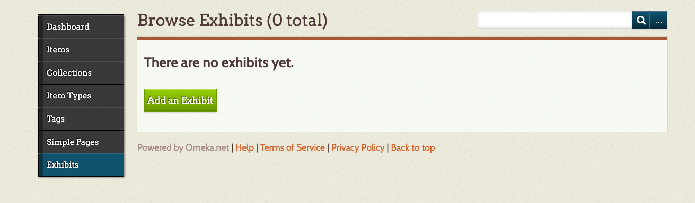
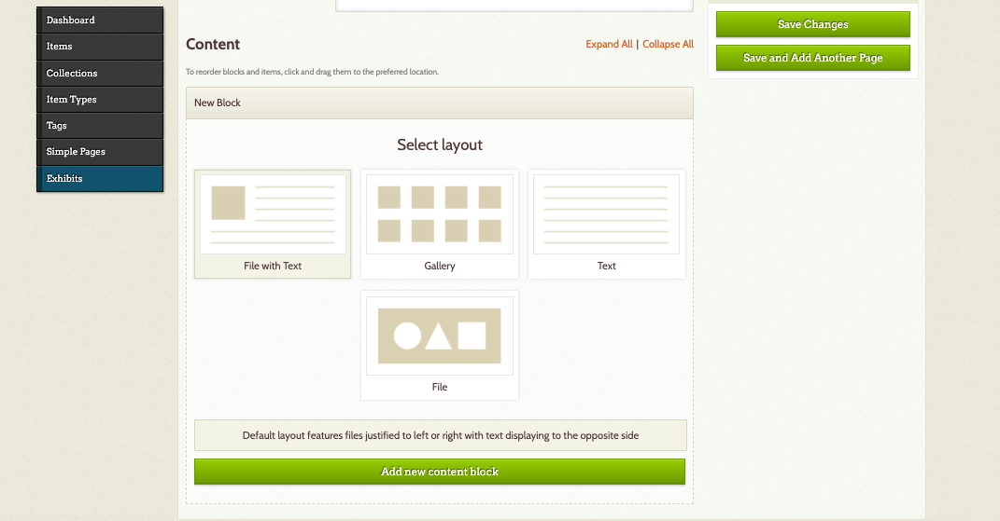

# Getting Started

Once you have logged in, you can **add a new site**. Fill in the information about your site’s URL, the title you want to use, and give your website a description.  

From here, you can manage your site, view your site, delete your site, and edit any of your personal information. It will also let you know how much storage you have used.

After you have created your Omeka site, select **Manage Site** and you will be taken to the **Dashboard** where you can edit your Omeka site.

## Themes

Omeka allows you to change the look of your site by changing the theme. To do this, select **Appearance** (at the top right of your dashboard). Switch themes by selecting one of the options on the page. Each theme allows you to make some modifications such as adding a logo, header and footer information, and choosing how you want items to be displayed on the homepage.

Omeka.net trial version only has two themes: **Berlin** and **Seasons**.
{: .note}

In **Appearances**, you can also rearrange your menu and add additional pages using an external url. For example, I have created an About Me page that links to my contact information on the UBC website.

## Plugins

Your Omeka.net trial site comes with some free plugins, which offer some extra functionality. In order to use them, you need to enable them. Select the **Plugins** menu item at the top right of the page.

If you want to create an exhibit, I suggest installing the **Exhibit Builder** and **Simple Pages**.

## Adding an item with metadata

To add an item, select **Items** on the left-hand menu and then **Add an item**. Be sure to click the Public checkbox if you want to make your item public.

Upload a file or files (e.g. PDF, JPEG, MP3). If you have already created a Collection, you can select a Collection that you would like the item to be a part of.

At this time, you can also input the metadata and tags. Omeka.net provides a link to show what information should go in each field, but you can also modify that a bit as long as you’re consistent. Once you’ve finished adding Dublin Core metadata, you can attach a file to your item record by selecting Files.

You can add multiple files, but the trial version only allows for 500 MB of storage space.
{: .note}

## Add a collection

If you would like to organize or group your items, you can create collections. Select **Collections** and select **Add a Collection**. You can also create metadata for each collection.

If you would like to add items to a collection, select the **Items** tab. From your Browse Items list, click the boxes of the items that belong in your new collection. Then select the **Edit** button.

## Adding an exhibit

While a collection really helps to group or organize items, an exhibit allows you to contextualize your items and guide your audience by using text and different layout options.

To create an exhibit, select Exhibits and Add an Exhibit. Enter in the metadata for your exhibit.

A slug is a machine-readable name for your exhibit and will become part of your URL.
{: .note}

## Add a page

An exhibit consists of pages. The pages are where you can feature your items. An exhibit can have multiple pages and the pages can be rearranged. To create a page, select **Add Page**. Fill in the information about your page and select a layout, and then Add New Content Block.

Content Blocks allow you to add an item and text to your page. You can add multiple content blocks.
